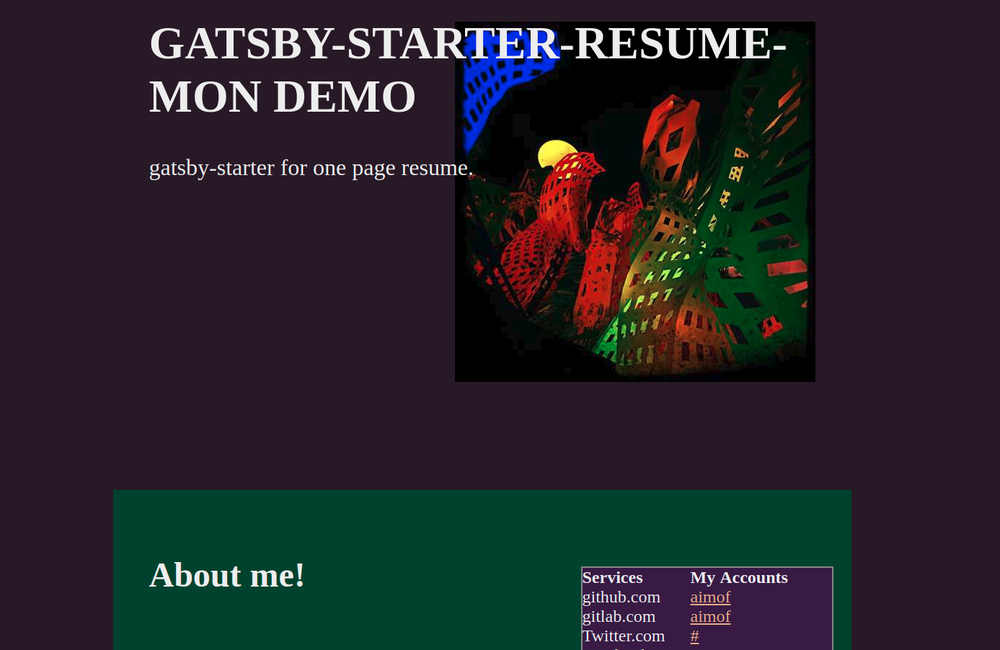
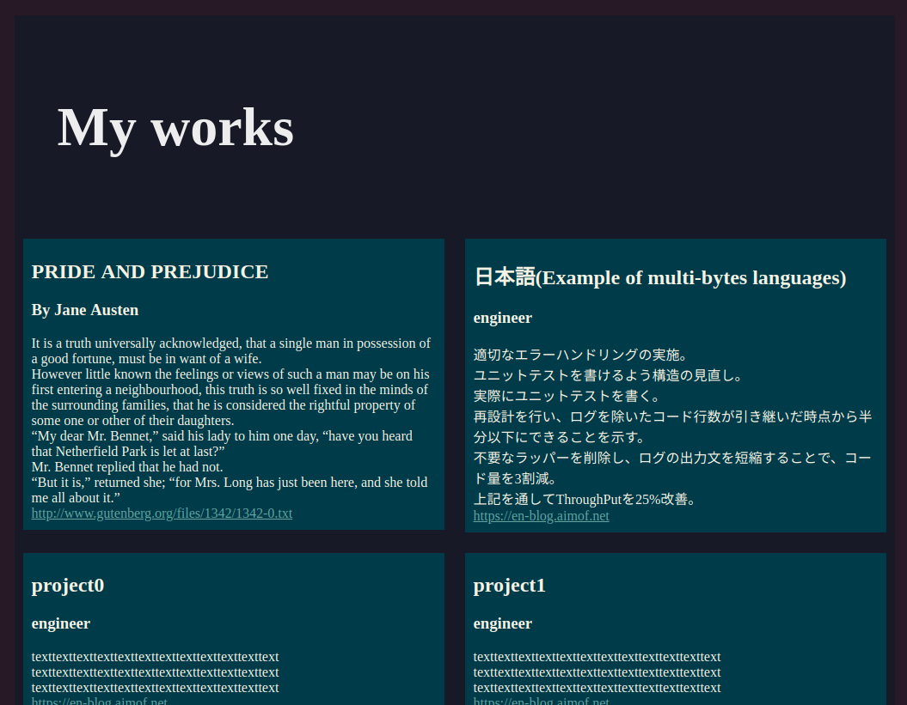

# gatsby-starter-resume-mon

Gatsby starter template for onepage resume named "mon.

## Preview



__[Demo site](https://mon-demo.aimof.net/)__

## Rocket Start

1. Create a Gatsby site.

```
npx gatsby new $DIRNAME https://gihtub.com/aimof/gatsby-starter-resume-mon
```

2. Start Editting.

```
cd $DIRNAME
```

All you need to rewrite is in contents/ directory.
If you want to watch your site on editting, run

```
gatsby develop -o
```

## Feature

Your working history cards



## Learning Resources

* [Gatsby Official](https://www.gatsbyjs.org/)
* [Gatsby Tutorial](https://www.gatsbyjs.org/tutorial/) <= recommended
* [Gatsby Docs](https://www.gatsbyjs.org/docs/)

* [](https://app.netlify.com/start/deploy?repository=https://github.com/gatsbyjs/gatsby-starter-default)


